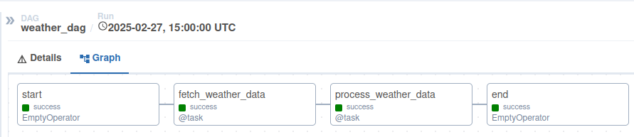
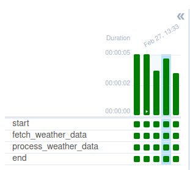

# Test Assignment for Data Engineer Position

This repository contains a complete data pipeline implementation, covering data extraction, transformation, and storage using modern data engineering tools. The project includes data cleaning, validation, structured storage, logging, and automation to ensure efficient data processing and management.
---

## 🧑‍💻 Task 1: NYC 2015 Street Tree Census Data Processing
### Requirements:
- **Download dataset from Kaggle: NYC 2015 Street Tree Census.**
- **Data Analysis & Cleaning:**
- **Perform Data Quality Analysis.**
- **Handle missing values, incorrect formats, duplicates, and errors.**
- **Database Setup in PostgreSQL:**
- **Define the schema based on cleaned data.**
- **Optimize table with indexes.**
- **Load Data into PostgreSQL:**
- **Insert cleaned dataset into the created table.**

---

## 🛠️ Provided Files:
- **task1/ - Directory containing the script for data processing.**
- **docker-compose.yml - Docker setup for PostgreSQL.**
- **SQL script - To create the required table.**
- **Python script - To clean and load the dataset into PostgreSQL.**

---

## 💻 How to Run Task 1:
- **Setup**
```bash
  git clone https://github.com/Fox1ine/DataWeave.git
cd task1
```
- **Start PostgreSQL using Docker:**
```bash
    docker-compose up -d
    
    To verify that PostgreSQL is running, use command :
    docker ps
```
- **Download & Install DBeaver:**
```bash

1.Create a Connection to PostgreSQL:
2.Open DBeaver.
3.Click Database → New Connection.
4.Select PostgreSQL.
5.In the connection settings, enter:
6.Take creds from .env
```
---

## 🐍 Provided Python Scripts:
### 📌 analyze_data.py - Initial Data Analysis
- **Loads the raw dataset from Kaggle.**
- **Performs exploratory data analysis (EDA):** Identifies missing values, duplicates, and inconsistent formats.
    Prints a summary of dataset structure and statistics.
- **Example output:**
```bash
Column 'tree_id': No missing values
Column 'species': 150 missing values detected
```
- **Starting from the root folder as a module**
```bash 
  python -m task1.src.analyze_data
```

### 📌 clean_data.py - Data Cleaning
- **Removes duplicate records.**
- **Handles null values by applying appropriate imputation or dropping.**
- **Standardizes column formats (e.g., date formats, numeric types).**
- **Saves the cleaned data to a .csv file for further processing.**

### 📌 create_table.py - Database Table Setup
- **Defines the PostgreSQL schema.**
- **Executes an SQL script to create an optimized table in PostgreSQL.**
- **Ensures indexes are created for faster queries.**

### 📌 load_data.py - Data Loading
- **Reads the cleaned dataset and inserts records into PostgreSQL.**
- **Uses batch inserts to improve performance.**

### 📌 test_connection.py - Database Connection Test
- **Verifies if PostgreSQL is accessible.**
- **Runs a simple SELECT query to validate data presence.**

### 📁 data folder
- **Raw data from API**
- **Data after cleaning**

---

## 📝 Additional information
### Missing Values in Multiple Columns:
#### Affected Columns:
- health (31,616 missing values)
- spc_latin, spc_common (31,619 missing values)
- steward (519,438 missing values)
- guards (603,922 missing values)
- sidewalk (31,616 missing values)
- problems (457,944 missing values)
- council district (6,519 missing values)
- census tract (6,519 missing values)
- bin, bbl (9,559 missing values)

Fix:
- For categorical columns like health, spc_latin, spc_common, steward, guards, sidewalk, and problems, missing values were replaced with "Unknown" or "Not Reported", depending on the column's context.
- For numerical columns like council district, census tract, bin, and bbl, missing values were forward-filled (ffill()) where possible, or replaced with -1 as a placeholder.
#### Duplicate Rows:
- Identified: 0 duplicate rows were found in the dataset.
- Fix: No action needed.

#### Incorrect Data Formats:
- Issue: created_at column stored as object (string).
- Fix: Converted created_at to a proper datetime format using:
 ```bash
      df['created_at'] = pd.to_datetime(df['created_at'], errors='coerce')
```

#### Inconsistent Column Names:
- Some column names had spaces or special characters that could cause issues when loading into PostgreSQL.
- Fix: Renamed columns for better consistency:
```bash 
    df.rename(columns={
        "community board": "community_board",
        "council district": "council_district",
        "census tract": "census_tract",
      }, inplace=True)
```

#### Outliers in tree_dbh (Tree Diameter):
- Issue: tree_dbh (diameter at breast height) had extreme values up to 450.
- Fix: Values greater than 100 were considered unrealistic and set to NaN, then forward-filled.
```bash
   df.loc[df['tree_dbh'] > 100, 'tree_dbh'] = np.nan
df['tree_dbh'].fillna(method='ffill', inplace=True)
```

#### Encoding Issues in Categorical Columns:
- 'status' column contains values: ['Alive', 'Stump', 'Dead']
- Fix: Converted to lowercase for consistency.
```bash
    df['status'] = df['status'].str.lower()
```


---


## 🧑‍💻 Task 2: Weather Data Collection and Processing
### Overview
This task involves setting up an Apache Airflow pipeline to collect hourly weather data for Minsk using the OpenWeatherMap API. 
The data includes temperature and wind speed and is stored in Parquet format for historical analysis.

---

### Requirements
Airflow Deployment:
- Deploy Airflow using Docker Compose. 
- Ensure Webserver, Scheduler, and Worker are correctly configured.

Weather Data Collection:
- Fetch temperature and wind data hourly using the OpenWeatherMap API.

Data Processing:
- Convert API response into pandas DataFrame.
Ensure the data contains:
- Temperature Data (temp.parquet):
- datetime, temp, feels_like, temp_min, temp_max, pressure 
- Wind Data (wind.parquet):
- datetime, speed, deg, gust

### **Storage:**
**Raw Data:** : 
- Fetched weather data is stored in JSON format inside the ```data/raw/ directory.```
- Filenames follow the pattern ```current_raw_{YYYYMMDD_HHMMSS}.json.```
**Processed Data** :
- Two main directories exist for structured storage: ```data/temperature/ → Stores hourly temperature data.```
- ```data/wind/ → Stores hourly wind data.```
**Inside each directory, data is grouped into daily folders, such as** :
- ```data/temperature/minsk_YYYY-MM-DD_temp/```
- ```data/wind/minsk_YYYY-MM-DD_wind/```

**Processed Data** :
Two main directories exist for structured storage: 
- ```data/temperature/ → Stores hourly temperature data.```
- ```data/wind/ → Stores hourly wind data.```

Inside each directory, data is grouped into daily folders, such as:
- ```data/temperature/minsk_YYYY-MM-DD_temp/```
- ```data/wind/minsk_YYYY-MM-DD_wind/```

Each folder contains hourly .parquet files named with timestamps:
- ```time-HH-MM-SS.parquet```

**Schedule DAG in Airflow:**
```Runs every 60 minutes.```

**Provided Files:**
- ```task2/ ``` - Contains Airflow DAG and weather processing scripts. 
- ```docker-compose.yml``` - Airflow deployment configuration.
- ```Example parquet files``` - Demonstrating expected output. 
- Screenshots of DAG execution in Airflow UI.

### **How to Run Task 2**
- Start Airflow with Docker:
```aiignore
docker-compose up -d
```
- Check Airflow Web UI (```default localhost:8080```).
- Enable and start the weather data pipeline:
```docker exec -it airflow_webserver airflow dags unpause weather_dag```
- Verify Data Output - Processed data should be saved in:
```aiignore
data/
 ├── temperature/
 │   ├── minsk_2025-02-27_temp/
 │       ├──time-13-00-03.parquet
 │   ├── minsk_2025-02-28_temp/
 │      ├──time-13-00-03.parquet
 │   
 ├── wind/
 │   ├── minsk_2025-02-27_wind/
 │       ├──time-13-00-03.parquet
 │   ├── minsk_2025-02-28_wind/
 │       ├──time-13-00-03.parquet
 
```

#### Docker Compose Configuration:
- The ```docker-compose.yml``` file provided in this repository sets up the following services:
```aiignore
PostgreSQL - Stores Airflow metadata.
Redis - Used as a message broker for task queues.
Airflow Webserver - Provides the UI for monitoring DAGs.
Airflow Scheduler - Periodically checks and triggers DAGs.
Airflow Worker - Executes tasks asynchronously.
```

#### Steps to Deploy Airflow Locally
- Ensure Docker and Docker Compose Are Installed:
```sudo apt update && sudo apt install -y docker.io docker-compose```
- After:
```docker-compose up -d```

#### Airflow DAG Execution Screenshots
Below are screenshots of the Airflow UI displaying DAG execution and task logs.



#### Notes
- The pipeline runs hourly, and each day's data is stored in its respective daily partition.
- DAG logs and errors can be found inside the ```logs/``` folder.
- Environment variables are managed via ```.env ``` for flexibility.
- Additional processing steps (e.g., aggregations, transformations) can be added in ```fetch_weather.py```,
- Examples of batch files are in the repository,
- Libraries can be loaded from - ```requirements.txt```.
    
---


